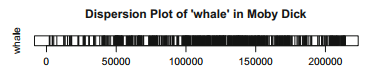

```{r setup, include=FALSE}
tutorial::go_interactive()
```

## Introduction

> "This chapter explains how to use the positions of words in a vector
> to create distribution plots showing where words occur across a narrative. We
> introduce the grep function and show how to use regular expressions for more
> nuanced pattern matching." 
> (Jockers 2020: 37)

This tutorial is based on Jockers' *Text Analysis with R For Students of Literature*, 
Chapter 4: "Token Distribution and Regular Expressions". 
The `grep()` function used in that chapter for search with regular expressions does 
not work well with Arabic script, so we  will use the search and replace 
functions from the tidyverse's `stringr` library instead. 

The [tidyverse](https://www.tidyverse.org/) is a collection of R packages
for data science that work together well because they share the same 
philosophy, grammar and data structures. 
The most important packages for us will be `stringr` (for working with text strings)
and `ggplot2` (for creating plots and other graphics).

To install all packages of the tidyverse, simply run: 

```
> install.packages("tidyverse")
```

This will install all packages in the tidyverse collection, including `stringr`.

Remember, a package needs to be installed only once; but in every session you 
want to use that package, you need to load it using the `library()` function. 

## Setting up

We will start the tutorial with some code we created in the previous classes. 
Please click the "Run" button below the script to load the example text
(al-Tabari's history) and tokenize it:

```{r}
library("stringr")  # importing libraries is always done at the top of a script

# make sure Arabic is displayed correctly: 
Sys.setlocale(category = "LC_ALL", locale = "C.UTF-8")

url <- "https://raw.githubusercontent.com/OpenITI/0325AH/master/data/0310Tabari/0310Tabari.Tarikh/0310Tabari.Tarikh.Shamela0009783BK1-ara1.completed"
text_v <- scan(url, what="character", sep="\n", encoding="UTF-8")
splitter_index <- which(text_v == "#META#Header#End#")
lines_v <- text_v[(splitter_index+1):length(text_v)]
book_v <- paste(lines_v, collapse = "\n")
book_word_l <- str_split(book_v, "\\W+")
book_word_v <- unlist(book_word_l)
```

## A word about coding style (Jockers p. 38)

It is good practice to stick to some principles while coding: 

* variable names: 
  - use lower-case characters, and split words by underscores
  - Jockers often uses a single character at the end of a variable name
    to indicate which data type is contained by the variable (`_v` for vector,
    `_l` for list, etc.)
* use spaces before operators like `<-` and `=`

These are not fixed rules in R (R does not care whether you use upper-case 
characters in variable names, and remove the spaces before and after `=`),
but adhering to a specific coding style makes it easier to read your code for 
others, and for yourself to remember how you named your variables.

For an example of a well-developed style guide for writing R code, see 
[https://style.tidyverse.org/syntax.html](https://style.tidyverse.org/syntax.html).

## Dispersion plots (Jockers p. 38-)

Chapter 2 showed how to calculate and display raw and relative frequencies of words
on the level of an entire book. In this chapter, we will look at how words
are distributed within one book. In Jockers' Moby Dick example: "At
what points, for example, does Melville really get into writing about whales?"

Instead of collapsing an entire book into a frequency table, which does not take
the sequence of words into account, we will now plot words in a sequence 
from the first word of the book to the last. 

In order to visualize the distribution of the use of a word in the text, we will
create a dispersion plot. A dispersion plot looks like a barcode: 



The black lines show each position in the text where the word is used. 
(every line is the same width; if some lines appear wider than others, that is 
because they are actually a lot of lines positioned closely together).

In order to create such a plot, we first have to identify where our word is
located in the text. As in chapter two, we will use the tokenized text 
(stored in the `book_word_v` variable) as the basis for our analysis. 

To identify the positions in which our word is used, we will use the `str_detect()` 
function. This function takes two arguments: a character vector containing one 
or more strings, and a regular expression pattern that describes the word(s) 
you want to match. The function checks for every string in the vector whether
it matches the regular expression you provided. It returns a vector that contains
TRUE for every string that matched the regular expression, and FALSE for every 
string that did not match. 

## A preparatory example

In programming, it is often useful to test your code with some dummy data, so 
we can understand better what is happening when you run the code. 
Let's do this for the `str_detect()` function, and see how it works: 

```{r}
library("stringr")  # load the `stringr` package, which contains the `str_detect` function
test_v <- c("ab", "ba", "ad", "aa")  # create a character vector with some dummy values
match_v <- str_detect(test_v, "a.")  # regular expression: match the character "a" followed by another character
match_v
```

If you push the `Run` button above, you will see the output of the `str_detect` 
function: a vector containing the value `TRUE` for every string in the `test_v` 
vector that contains the character "a" followed by another character, 
and the value `FALSE` for every string that does not match the regular expression.

We can now use the `plot()`  function to create a dispersion plot from the output
of the `str_detect` function: 


```{r}
library("stringr")
test_v <- c("ab", "ba", "ad", "aa")
match_v <- str_detect(test_v, "a.")
plot(match_v, 
     type = "h",         # "h" stands for histogram (see below)
     ylim = c(0, 1),     # set the maximum value of the Y axis to 1
     yaxp = c(0, 1, 1),  # set the y axis values (1 interval,  between 0 and 1)
     xaxp = c(1, 4, 3),  # set the x axis values (3 intervals, between 1 and 4)
)
```


Because we set the plot type to `h` (for "histogram"), the `plot()` function will, 
for every element in the `match_v` vector, draw a vertical line from the X axis; 
the length of the vertical line is defined by the element's value.  
This works because for our `match_v` vector because that vector contains `TRUE` and `FALSE` 
values, which the `plot()` function automatically converts to their numerical equivalents, 
`1` and `0`:

* for the first element in the `match_v` vector (`TRUE`), the `plot()` function 
will draw a line of height 1 on position 1 of the x axis;
* for the second element in the `match_v` vector (`FALSE`), the `plot()` function 
will draw a line of height 0 on position 2 of the x axis;
* for the third element in the `match_v` vector (`TRUE`), the `plot()` function 
will draw a line of height 1 on position 3 of the x axis;
* for the fourth element in the `match_v` vector (`TRUE`), the `plot()` function 
will draw a line of height 1 on position 4 of the x axis


## A real-world example

We will use the terms *ḥaddathanī/ḥaddathanā*, "he transmitted to me/us" as an
example. These terms are very important in the context of the isnād, a common 
citation practice in Arabic texts, in which a report is quoted together with 
every person (transmitter) who links the source to the original event reported.

This is an example of an isnād: 

فحدثني محمد بن عمارة الأسدي ومحمد بن منصور قالا:
حدثنا عبيد الله بن موسى، قال: أخبرنا موسى بن عبيده عن اياس ابن سلمة بن
الأكوع، عن أبيه، قال: بعثت قريش

Muḥammad b. ʿUmārab al-Asadī and Muḥammad b. Manṣūr transmitted to me: 
ʿUbayd Allāh b. Mūsā transmitted to me: Mūsā b. ʿUbayda transmitted to me, 
on the authority of Iyās ibn Salama b. al-Akwaʿ, on the authority of his father: 
"Qurays sent etc."
  
  
The verb *ḥaddatha* is related to the term *ḥadīth*, which is used for transmitted
reports on the words and deeds of the Prophet Muḥammad. 
The implications of the term *ḥaddathanī/ḥaddathanā* are not well understood; 
in ḥadīth studies, it is generally accepted that the term indicates direct oral/aural
transmission of a report from a teacher to a student (as opposed to 
citation from a written book outside of a teaching context). There is less of a 
consensus on the use of the term in other genres than ḥadīth works. 

We will try to use dispersion plots to get an insight into the distribution of this 
term, and another often used transmission term, *akhbaranī/akhbaranā*, 
"he transmitted to us", in al-Ṭabarī's History. That work is a universal history
from the creation to the year 302 AH / 915 CE; the period after 
the hijra is organized in an annalistic way (the events of each year are narrated
in a separate chapter). 

First, we will create a vector that records which tokens in the text match
a regular expression pattern that describes all possible variations of the term: 
`حدثن[ياى]` (that is, the string "ḥaddathan" followed by either alif (ā), yā\' (ī), 
or alif maqṣūra (which is often used to represent a yā\' in final position in 
printed books)).

NB: RStudio, like many other text editors, has trouble displaying right-to-left 
and left-to-right text on the same line in a way that is easily understandable 
for a human reader. 

In the regular expression above, we first typed "حدثن", followed by the opening
bracket; RStudio automatically adds a closing bracket, and the brackets jump to 
the right of the Arabic word automatically. When you start writing Arabic text 
into the brackets, the opening bracket jumps to the left of "حدثن", but the closing
bracket remains to the right. 

In order to make your patterns more readable, you can break down your regex pattern
in chunks that R can display well on one line, and then use the `paste()` function
to concatenate the partial patterns into a single pattern:

```
ptrn_1 <- "حدثن"
ptrn_2 <- "[ياى]"
ptrn <- paste(ptrn_1, ptrn_2, sep="")  # concatenate the two patterns into a single pattern
```

This code will create such a plot (you will have to write the regular expression
into the code yourself!): 


```{r ex="str_detect", type="pre-exercise-code"}
if(! ("stringr" %in% (.packages()))) library("stringr")

if (! (exists("book_word_v"))) {
  # make sure Arabic is displayed correctly: 
  Sys.setlocale(category = "LC_ALL", locale = "C.UTF-8")
  
  url <- "https://raw.githubusercontent.com/OpenITI/0325AH/master/data/0310Tabari/0310Tabari.Tarikh/0310Tabari.Tarikh.Shamela0009783BK1-ara1.completed"
  text_v <- scan(url, what="character", sep="\n", encoding="UTF-8")
  splitter_index <- which(text_v == "#META#Header#End#")
  lines_v <- text_v[(splitter_index+1):length(text_v)]
  book_v <- paste(lines_v, collapse = "\n")
  book_word_l <- str_split(book_v, "\\W+")
  book_word_v <- unlist(book_word_l)
}

```


```{r ex="str_detect", type="sample-code"}
# write the pattern here: 
ptrn_1 <-
ptrn_2 <-
  
ptrn <- paste(ptrn_1, ptrn_2, sep="")  # concatenate both patterns into a single pattern

haddathani_v <- str_detect(book_word_v, ptrn)

plot(haddathani_v, 
     type = "h",      # "h" stands for histogram
     yaxt = "n",      # do not include tick marks for values on the Y axis
     ylim = c(0, 1),  # set the maximum value of the Y axis to 1
     xlim = c(0, length(haddathani_v)), # set the maximum value of the X axis to the number of tokens in the text
     main = "Dispersion plot for haddathani/a",  # title for the plot
     xlab = "Index positions",                   # label for the x axis
     ylab = ""                                   # label for the y axis
)
```

The sheer amount of matches make it dificult to draw far-reaching conclusions
from this plot. But at least we can see that 

* the use of the term *ḥaddatha*  is much more prevalent in the first two thirds 
of the work than in the last third
* there are a number of sections in the first third of the work in which the 
term is not mentioned. 

Now, modify the code above yourself to create a dispersion plot for the terms أخبرني and 
أخبرنا:

```{r ex="akhbarani", type="pre-exercise-code"}
if(! ("stringr" %in% (.packages()))) {
  library("stringr")
}
if (! (exists("book_word_v"))) {
  # make sure Arabic is displayed correctly: 
  Sys.setlocale(category = "LC_ALL", locale = "C.UTF-8")
  
  url <- "https://raw.githubusercontent.com/OpenITI/0325AH/master/data/0310Tabari/0310Tabari.Tarikh/0310Tabari.Tarikh.Shamela0009783BK1-ara1.completed"
  text_v <- scan(url, what="character", sep="\n", encoding="UTF-8")
  splitter_index <- which(text_v == "#META#Header#End#")
  lines_v <- text_v[(splitter_index+1):length(text_v)]
  book_v <- paste(lines_v, collapse = "\n")
  book_word_l <- str_split(book_v, "\\W+")
  book_word_v <- unlist(book_word_l)
}

```

```{r ex="akhbarani", type="sample-code"}
library("stringr")

# make sure Arabic is displayed correctly: 
Sys.setlocale(category = "LC_ALL", locale = "C.UTF-8")

# write the pattern here: 
ptrn_1 <-
ptrn_2 <-

ptrn <- paste(ptrn_1, ptrn_2, sep="")  # concatenate both patterns into a single pattern
akhbarani_v <- 

plot(
  
  
  
  
  
  
)
```

```{r ex="akhbarani", type="solution"}
library("stringr")

# make sure Arabic is displayed correctly: 
Sys.setlocale(category = "LC_ALL", locale = "C.UTF-8").

# write the pattern here: 
ptrn_1 <-
ptrn_2 <-

ptrn <- paste(ptrn_1, ptrn_2, sep="")  # concatenate both patterns into a single pattern
akhbarani_v <- str_detect(book_word_v, ptrn)

plot(akhbarani_v, 
     type = "h",      # "h" stands for histogram
     yaxt = "n",      # do not include tick marks for values on the Y axis
     ylim = c(0, 1),  # set the maximum value of the Y axis to 1
     xlim = c(0, length(akhbarani_v)), # set the maximum value of the X axis to the number of tokens in the text
     main = "Dispersion plot for akhbarani/a",   # title for the plot
     xlab = "Index positions",                   # label for the x axis
     ylab = "",                                  # label for the y axis
)
```

The plot shows that the term *akhbara* is used much less intensively in the book than 
*ḥaddatha*, especially in the first third of the book. 

These observations do not prove anything by themselves, but they can serve as 
starting points for further analysis of citation patterns in al-Ṭabarī's history.

## multi-word patterns

The approach outlined above works only with tokenized text. 

If the pattern we are looking for is not limited to one specific word, we cannot 
use a text tokenized into separate words, but have to tokenize it in a different 
way.

NB: we can also use non-tokenized text, and use the index location of each character
in the text as ancher points for the visualization. 

One way to do this, is by using each line of text as a token.
During the tokenization process, we have already created a vector that 
contains every line as a separate string: `lines_v`. 
This line-by-line approach would work well,
for example, if we want to contrast the distribution of the use of *ḥaddatha* 
in the book in general, with the distribution of the term as the first element
in the chain of transmission (that is, the immediate source the author of the 
book took the report from). Since our text is formatted in OpenITI mARkdown 
format, we can use the mARkdown tag for the start of a paragraph (hashtag `#` 
followed by a space) to identify the cases where *ḥaddathanā/ī* is the first word
of a transmission chain. 

Write the regular expression that can be used to identify the instances where
*ḥaddathanā/ī* is the first word of a transmission chain, fill in the `plot`
function, and run the code:


```{r ex="haddathani_first", type="pre-exercise-code"}
if(! ("stringr" %in% (.packages()))) library("stringr")

if (! (exists("lines_v"))) {
  # make sure Arabic is displayed correctly: 
  Sys.setlocale(category = "LC_ALL", locale = "C.UTF-8")
  
  url <- "https://raw.githubusercontent.com/OpenITI/0325AH/master/data/0310Tabari/0310Tabari.Tarikh/0310Tabari.Tarikh.Shamela0009783BK1-ara1.completed"
  text_v <- scan(url, what="character", sep="\n", encoding="UTF-8")
  splitter_index <- which(text_v == "#META#Header#End#")
  lines_v <- text_v[(splitter_index+1):length(text_v)]
  book_v <- paste(lines_v, collapse = "\n")
  book_word_l <- str_split(book_v, "\\W+")
  book_word_v <- unlist(book_word_l)
}

```

```{r ex="haddathani_first", type="sample-code"}

# build  the regular expression that can be used to identify the instances where haddathana/i is the first word of a transmission chain: 
ptrn_0 <- ""  # start of line, followed by hashtag and space, and optionally one of the conjunctions wa- or fa-
ptrn_1 <- ""  # haddathan
ptrn_2 <- ""  # alif, ya or alif maqsura
ptrn <- paste(ptrn_0, ptrn_1, ptrn_2, sep="")  # concatenate all patterns into a single pattern
haddathani_first_v <- str_detect(lines_v, ptrn)

# plot the vector (we add some more arguments here to prettify the graph):
plot(
  
  
  
  
  

)
```

```{r ex="haddathani_first", type="hint"}
"You can use the expression "^# .?", for the beginning of the line; or to be more precise, use the letters waw and fa between square brackets instead of the full stop."
```


```{r ex="haddathani_first", type="solution"}
library("stringr")

# build  the regular expression that can be used to identify the instances where haddathana/i is the first word of a transmission chain: 
ptrn_0 <- ""  # start of line, followed by hashtag and space, and optionally one of the conjunctions wa- or fa-
ptrn_1 <- ""  # haddathan
ptrn_2 <- ""  # alif, ya or alif maqsura
ptrn <- paste(ptrn_0, ptrn_1, ptrn_2, sep="")  # concatenate all patterns into a single pattern
haddathani_first_v <- str_detect(lines_v, ptrn)

# plot the vector (we add some more arguments here to prettify the graph):
plot(haddathani_first_v, 
     type = "h",      # "h" stands for histogram
     yaxt = "n",      # do not include tick marks for values on the Y axis
     ylim = c(0, 1),  # set the maximum value of the Y axis to 1
     xlim = c(0, length(lines_v)), # set the maximum value of the X axis to the number of tokens in the text
     main = "Dispersion plot for haddathani/a in initial position",  # title for the plot
     xlab = "Index positions",                   # label for the x axis
     ylab = "",                                  # label for the y axis
)
```

This plot is much more informative than the first plot we made for the term 
*ḥaddatha*: it shows that al-Ṭabarī's use of the term 
ḥaddatha in the first position of a chain of transmitters (that is, to describe 
his direct source), is strongly clustered in two sections at the beginning of the
work, and gradually declines in the later years of his History. 

```{r ex="akhbarani_first", type="pre-exercise-code"}
if(! ("stringr" %in% (.packages()))) library("stringr")

if (! (exists("lines_v"))) {
  # make sure Arabic is displayed correctly: 
  Sys.setlocale(category = "LC_ALL", locale = "C.UTF-8")
  
  url <- "https://raw.githubusercontent.com/OpenITI/0325AH/master/data/0310Tabari/0310Tabari.Tarikh/0310Tabari.Tarikh.Shamela0009783BK1-ara1.completed"
  text_v <- scan(url, what="character", sep="\n", encoding="UTF-8")
  splitter_index <- which(text_v == "#META#Header#End#")
  lines_v <- text_v[(splitter_index+1):length(text_v)]
  book_v <- paste(lines_v, collapse = "\n")
  book_word_l <- str_split(book_v, "\\W+")
  book_word_v <- unlist(book_word_l)
}

```


```{r ex="akhbarani_first", type="sample-code"}
# write the pattern here: 
ptrn_1 <- ""  # start of line, followed by hashtag and space, and optionally one of the conjunctions wa- or fa-
ptrn_2 <- ""          # alif or alif-with-hamza
ptrn_3 <- ""      # khbaran
ptrn_4 <- ""          # i/a

ptrn <- paste(ptrn_1, ptrn_2, ptrn_3, ptrn_4, sep="")  # concatenate all patterns into a single pattern

# complete the variable attribution using the str_detect() function:
akhbarani_first_v <- 

plot(
  
  
  
  
  
  
)
```

```{r ex="akhbarani_first", type="solution"}
library("stringr")
# write the pattern here: 
ptrn_1 <- ""  # start of line, followed by hashtag and space, and optionally one of the conjunctions wa- or fa-
ptrn_2 <- ""  # alif or alif-with-hamza
ptrn_3 <- ""  # khbaran
ptrn_4 <- ""  # i/a

ptrn <- paste(ptrn_1, ptrn_2, ptrn_3, ptrn_4, sep="")  # concatenate all patterns into a single pattern

akhbarani_first_v <- str_detect(lines_v, ptrn)

plot(akhbarani_first_v, 
     type = "h",      # "h" stands for histogram
     yaxt = "n",      # do not include tick marks for values on the Y axis
     ylim = c(0, 1),  # set the maximum value of the Y axis to 1
     xlim = c(0, length(lines_v)), # set the maximum value of the X axis to the number of tokens in the text
     main = "Dispersion plot for akhbarani/a in initial position",  # title for the plot
     xlab = "Index positions",                   # label for the x axis
     ylab = "",                                  # label for the y axis
)
```

The contrast between *akhbara* and *ḥaddatha* becomes much clearer here: al-Ṭabarī 
clearly used the term akhbara very rarely in the citation of his own sources, 
even though the term is used frequently in other positions in the transmission 
chains. 

These graphs can be used as starting-off points for deeper analysis of the citation
patterns in al-Ṭabarī's History. 


